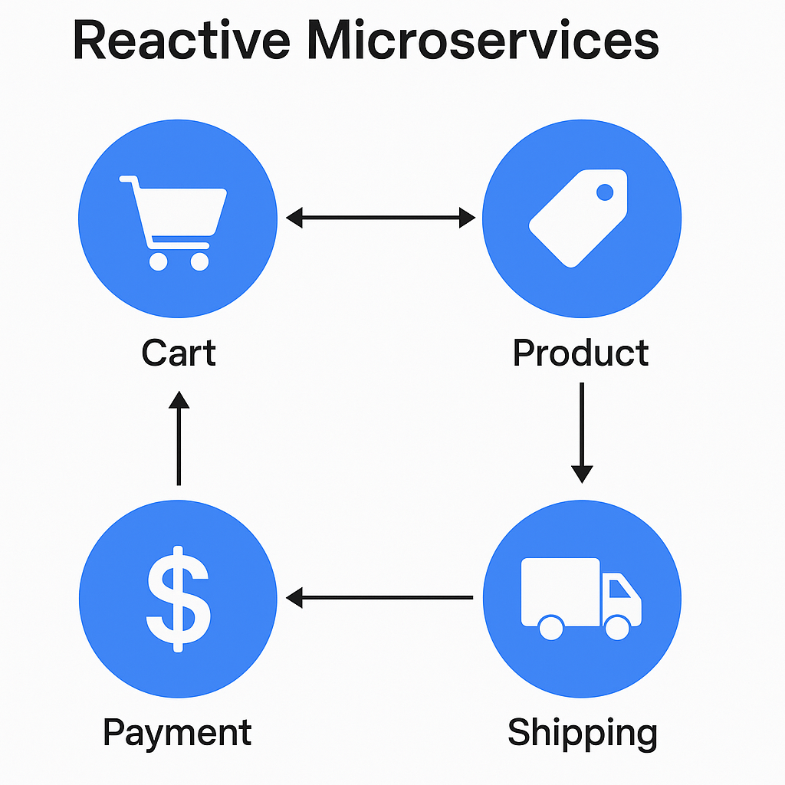
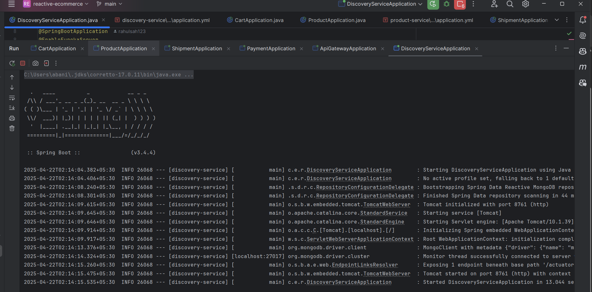
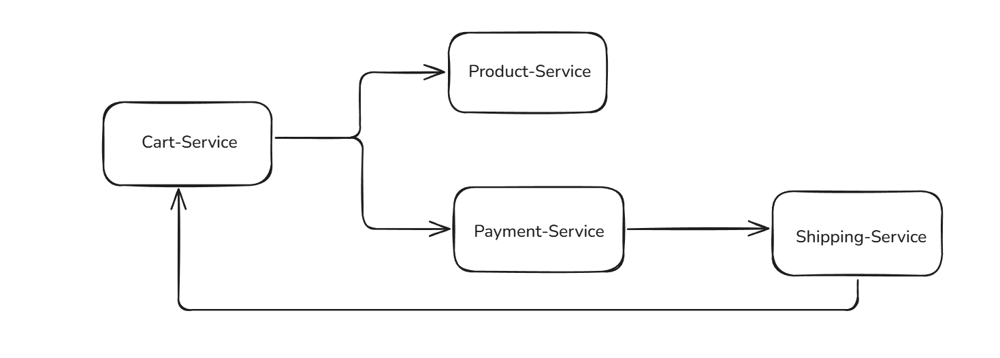

# Reactive E-commerce Microservices

This project includes:
- Product Service
- Cart Service
- Payment Service
- Shipping Service
- API Gateway
- Eureka Discovery Service

All services are built with Spring Boot WebFlux and communicate asynchronously via Kafka.

